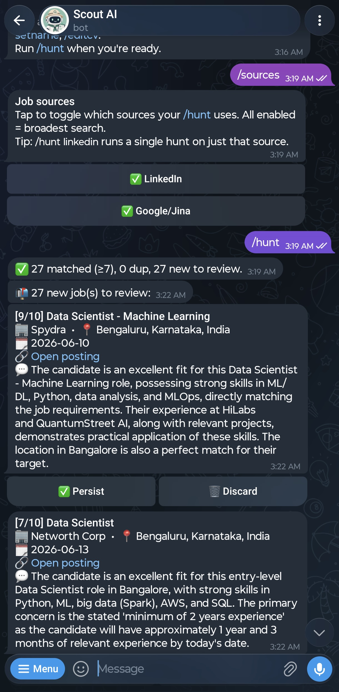

<!-- PROJECT LOGO -->
<a id="readme-top"></a>
<br />
<div align="center">
  <a href="https://github.com/prayashdash1729/scout">
    
  </a>

  <h3 align="center">Scout</h3>

  <p align="center">
    A <a href="https://t.me/scoutai_jobs_bot">Telegram Bot</a> that hunts jobs for you. Upload your CV once; on /hunt it searches job boards, scores each posting against your CV with Gemini, and sends new matches as Persist / Discard cards. Multi-user, runs in Docker.
    <br />
    <br />
    <a href="https://github.com/prayashdash1729/scout/issues">Report Bug</a>
    ·
    <a href="https://github.com/prayashdash1729/scout/issues">Request Feature</a>
  </p>
</div>


<!-- TABLE OF CONTENTS -->
<details open>
  <summary>Table of Contents</summary>
  <ol>
    <li>
      <a href="#about-the-project">About The Project</a>
    </li>
    <li>
      <a href="#using-the-bot">Using the bot</a>
    </li>
    <li>
      <a href="#self-hosting">Self-hosting</a>
      <ul>
        <li><a href="#prerequisites">Prerequisites</a></li>
      </ul>
      <ul>
        <li><a href="#run">Run</a></li>
      </ul>
    </li>
    <li><a href="#configuration">Configuration</a></li>
    <li><a href="#job-sources">Job sources</a></li>
    <li><a href="#built-with">Built With</a></li>
    <li><a href="#security">Security</a></li>
  </ol>
</details>


## About The Project

```
Telegram ⇄ bot → LinkedIn / Google(Jina) → Gemini scoring → Postgres
```

<div align="center">
<!-- [![Product Name Screen Shot][assets/readme_images/jobs_in_chat.png]](https://github.com/prayashdash1729/scout) -->

</div>

---

## Using the bot

Message the bot and run `/start` to onboard (name → CV PDF → roles → cities →
experience). Then:

| Command | What it does |
|---|---|
| `/hunt` | Search, score & surface new matching jobs |
| `/hunt linkedin` | One-off hunt using just the named source(s) |
| `/sources` | Toggle which job sources your hunts use |
| `/me` | Show your saved profile |
| `/setroles`, `/setcities`, `/setexp`, `/setname` | Edit profile fields |
| `/editcv` | Upload a new CV PDF |
| `/help` | Full command list |

Each match arrives as a card with a fit score and reason — tap **✅ Persist** or
**🗑 Discard**. Discarded/persisted jobs are never shown again.

---

## Self-hosting

### Prerequisites
- Docker + Docker Compose
- A Telegram bot token (create one via [@BotFather](https://t.me/BotFather))
- Gemini access — either a **Gemini API key** or a **Vertex AI** service account
- A [Jina](https://jina.ai) API key (search + page reading)
- *(Recommended for cloud)* a [ScraperAPI](https://scraperapi.com) key — lets the
  server reach LinkedIn from datacenter IPs

### Run
```bash
git clone https://github.com/prayashdash1729/scout.git
cd scout
cp .env.example .env        # then fill in your keys (see Configuration)
docker compose up -d --build
docker compose logs -f bot  # wait for "Bot is up."
```
Message your bot `/start`. To switch it off: `docker compose stop bot`.

> **Note:** the bot uses Telegram long-polling — no public URL or ports needed.
> It must run on a network where `api.telegram.org` is reachable (some
> corporate/campus networks block it).

---

## Configuration

All config is environment variables (see [`.env.example`](.env.example) for the
full list). The essentials:

| Variable | Required | Notes |
|---|---|---|
| `TELEGRAM_BOT_TOKEN` | ✅ | From @BotFather |
| `TELEGRAM_BOT_USERNAME` | ✅ | Your bot's @username |
| `JINA_API_KEY` | ✅ | Search + page reader |
| `GEMINI_BACKEND` | ✅ | `vertex` or `api` |
| `GEMINI_API_KEY` | if `api` | Gemini API key |
| `GOOGLE_APPLICATION_CREDENTIALS` + `GOOGLE_CLOUD_PROJECT` | if `vertex` | Path to SA JSON + project id |
| `GEMINI_MODEL` | – | Default `gemini-2.5-flash` |
| `SCRAPER_API_KEY` | – | Proxy for LinkedIn on cloud |
| `ALLOWED_TELEGRAM_IDS` / `ALLOWED_TELEGRAM_USERNAMES` | – | Allowlist; empty = open to anyone |
| `SCORE_THRESHOLD`, `HUNT_COOLDOWN_MINUTES`, `MAX_HUNTS_PER_DAY`, `MAX_LINKS_PER_HUNT` | – | Limits & abuse control |
| `LINKEDIN_ENABLED`, `JINA_ENABLED`, `NAUKRI_ENABLED` | – | Source switches + filters |

Postgres runs as a Compose service with a persistent `pgdata` volume — data
survives restarts. `DATABASE_URL` is wired automatically for the bot container.

---

## Job sources

| Source | Status |
|---|---|
| **LinkedIn** | Primary — guest API (no login), fresh + filtered postings |
| **Google / Jina** | Supplementary keyword search |
| **Naukri** | Disabled — anti-bot blocks all no-login access |

Adding a new board is a single module implementing `search` + `fetch_jd`, plus
one entry in the source-registry at `app/services/sources.py`.

---

## Built With

* [![Python][Python]][Python-url]
* [![python-telegram-bot][PTB]][PTB-url]
* [![Google Gemini][Gemini]][Gemini-url]
* [![Pydantic][Pydantic]][Pydantic-url]
* [![SQLAlchemy][SQLAlchemy]][SQLAlchemy-url]
* [![PostgreSQL][Postgres]][Postgres-url]
* [![Docker][Docker]][Docker-url]

Architecture details: see [`CLAUDE.md`](CLAUDE.md).

<p align="right">(<a href="#readme-top">back to top</a>)</p>

## Security
Lock the bot to yourself with `ALLOWED_TELEGRAM_IDS` in `.env`. Scraping job boards may conflict with their ToS —
use responsibly, never with a logged-in account.

<!-- MARKDOWN LINKS & IMAGES -->
[Python]: https://img.shields.io/badge/Python-3776AB?style=for-the-badge&logo=python&logoColor=white
[Python-url]: https://www.python.org
[PTB]: https://img.shields.io/badge/python--telegram--bot-26A5E4?style=for-the-badge&logo=telegram&logoColor=white
[PTB-url]: https://python-telegram-bot.org
[Gemini]: https://img.shields.io/badge/Google%20Gemini-8E75B2?style=for-the-badge&logo=googlegemini&logoColor=white
[Gemini-url]: https://ai.google.dev
[Pydantic]: https://img.shields.io/badge/Pydantic-E92063?style=for-the-badge&logo=pydantic&logoColor=white
[Pydantic-url]: https://docs.pydantic.dev
[SQLAlchemy]: https://img.shields.io/badge/SQLAlchemy-D71F00?style=for-the-badge&logo=sqlalchemy&logoColor=white
[SQLAlchemy-url]: https://www.sqlalchemy.org
[Postgres]: https://img.shields.io/badge/PostgreSQL-4169E1?style=for-the-badge&logo=postgresql&logoColor=white
[Postgres-url]: https://www.postgresql.org
[Docker]: https://img.shields.io/badge/Docker-2496ED?style=for-the-badge&logo=docker&logoColor=white
[Docker-url]: https://www.docker.com
[project-screenshot]: assets/readme_images/jobs_in_chat.png